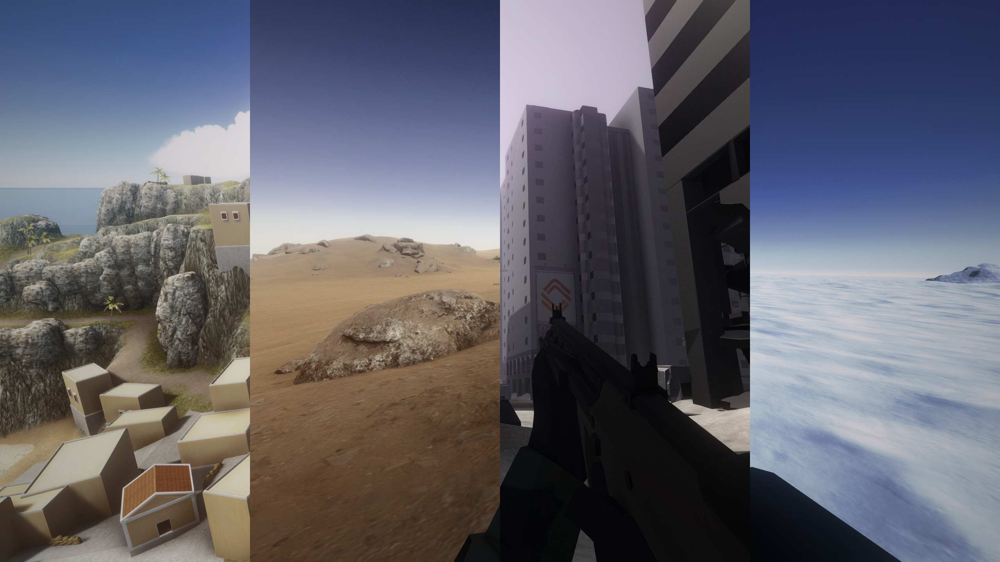
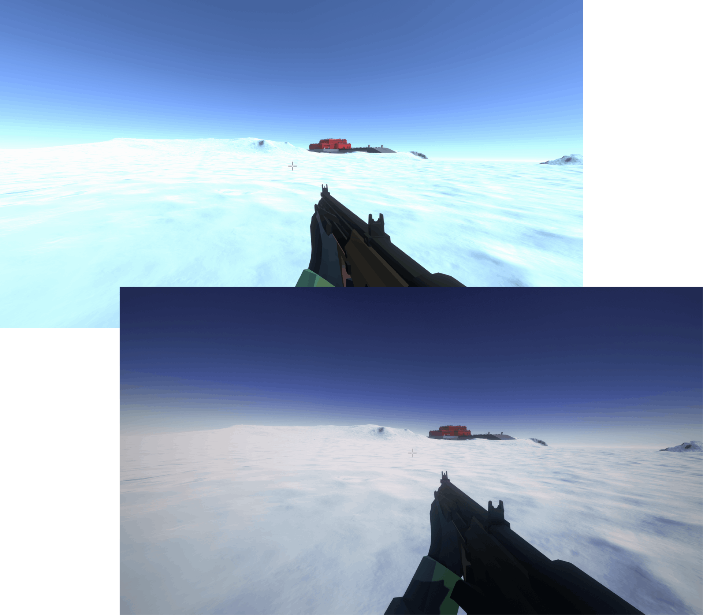
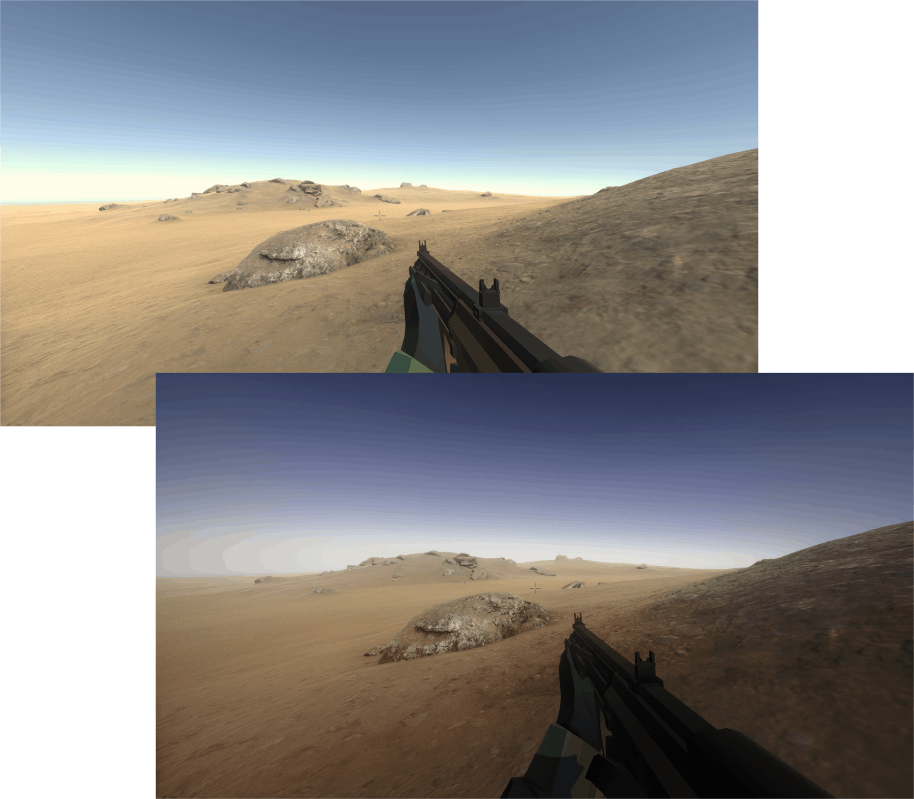
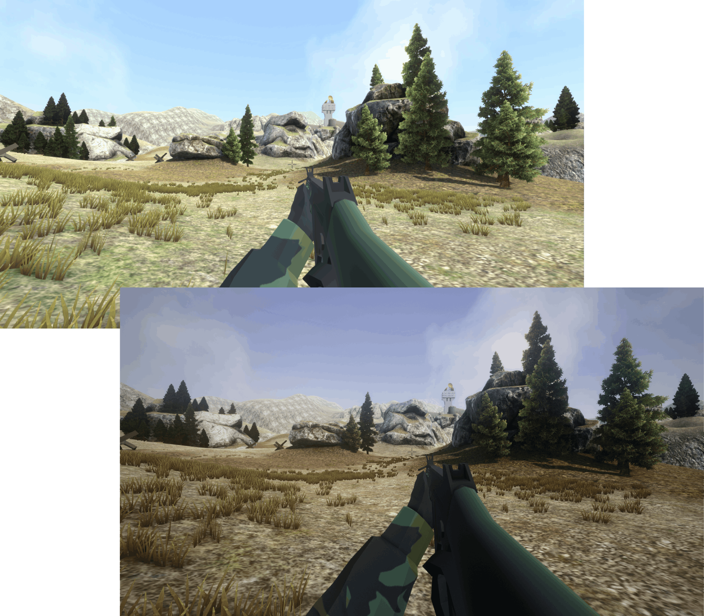
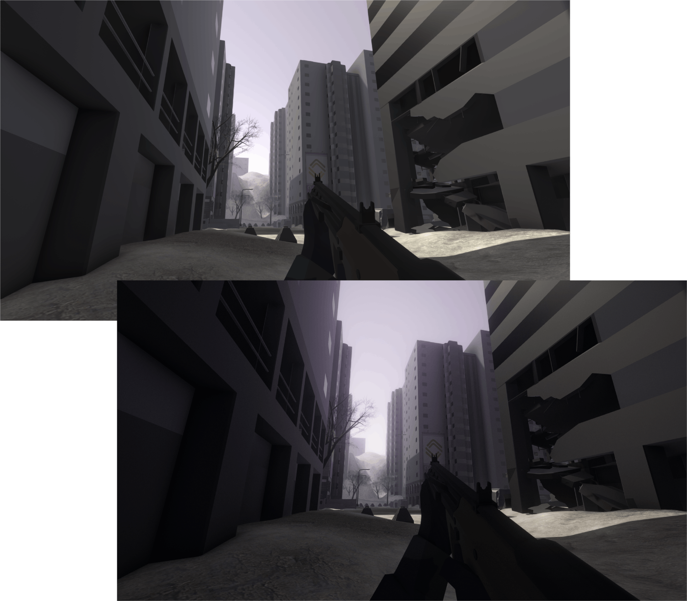

# Ravamp :art:
A Ravenfield ReShade preset designed to revamp the in-game experience!

 

## Description

I designed this preset with the goal of refining the in-game appearance of Ravenfield. There is nothing but love for the game here but I’m sure we can all agree the default appearance has… *quirks*. This config, in my opinion, ameliorates these quirks, makes the base game less visually fatiguing and more enjoyable to play.

My goal is to simply and subjectively enhance Ravenfield while honoring the default vibe of the game.

#### Warning

This is a relatively hefty preset with 14 total effects being applied! Performance may vary from machine to machine.

 

## Getting Started :rocket:

#### Dependencies

- [ReShade](https://reshade.me/) – Follow [this](https://steamcommunity.com/sharedfiles/filedetails/?id=2091281086) guide if you don’t know how to install.

#### Installing

1. [Download](https://github.com/Heldaeus/ravamp/releases/) the latest release of this repository.
2. Unzip the downloaded folder and copy `ravamp.ini` into your Ravenfield root directory.
3. Run the game and press the `Home` key to open the ReShade overlay menu.
4. Click the preset selection button at the top of the menu and select `ravamp.ini`.
5. Press `Select` and Enjoy!

#### Help

> How do I open Ravenfield’s root directory?

Go to your Steam library and right click Ravenfield in the left side panel. Click `Properties` and in the pop up window select `Local Files` then click `Browse`.

> The preset looks different on my screen than in your screen-shots.

Make sure you have every effect selected when you install ReShade. If all effects are installed but the preset still looks off then clear your effect cache; ReShade > Settings > Clear Effect Cache. If after this you’re still having troubles I recommend reinstalling ReShade.

> I installed the preset but there is an upside-down outline of my weapon on the screen. How do I fix this?

If you’re having this problem you need to change the `RESHADE_DEPTH_INPUT_IS_UPSIDE_DOWN` setting in your global preprocessor definitions from 0 to 1.

> When in third person the bloom effects disappear.

This seems to be a bug with how Ravenfield or mods interact with ReShade. It is possible that there is a setting that can be changed to fix this issue but I have not found it yet. I would consider re-installing ReShade and see if that fixes the problem.

 

## Version History :clock4:

- **1.2** 
  - I calibrated my monitor to achieve better neutrality.
  - The warm color cast was removed.
  - Contrast was tweaked for better texture detail.
  
- **1.1**
  - Improve color tone for greenery and shadows.
- **1.0**
  - Initial release.
  - I have like 40 hours in the game and 30 of them went to making this preset lol

 

## Before and After :last_quarter_moon:

 

  
&nbsp; &nbsp; &nbsp; &nbsp;
  

  
&nbsp; &nbsp; &nbsp; &nbsp;
  

 

## Contributing :handshake:

If you have an issue with this preset or an idea for improvements please consider opening a feature request in the issues tab. Describe the problem you’re experiencing and we can collaborate on solutions!

 

## License

This project is licensed under the Creative Commons Zero v1.0 Universal license. See the LICENSE file for more information.
